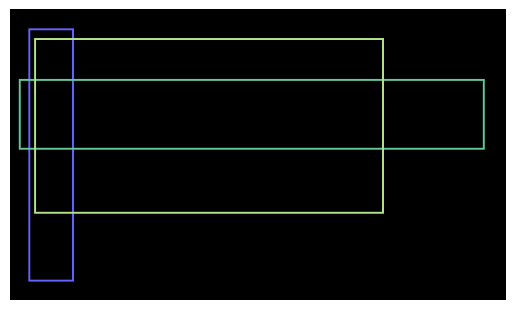
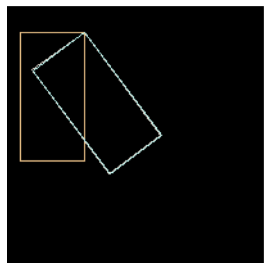
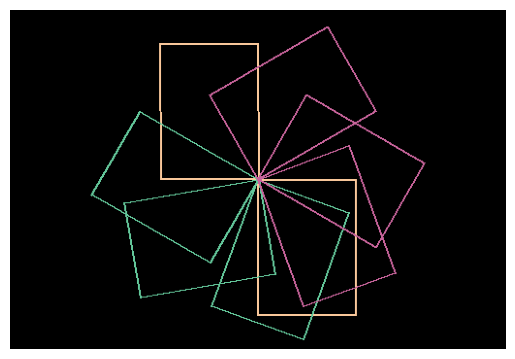
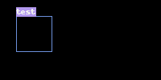
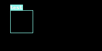

# Visualization


<!-- WARNING: THIS FILE WAS AUTOGENERATED! DO NOT EDIT! -->

------------------------------------------------------------------------

<a
href="https://github.com/lgvaz/polvo/blob/master/polvo/bbox/vis.py#L20"
target="_blank" style="float:right; font-size:smaller">source</a>

### overlay

>      overlay (image:<module'PIL.Image'from'/opt/hostedtoolcache/Python/3.10.14
>               /x64/lib/python3.10/site-packages/PIL/Image.py'>,
>               bbox:polvo.bbox.core.BBox, color:Tuple[int,int,int]=None)

*Draws a box on an image with a given color. \# Arguments image : The
image to draw on. box : A list of 4 elements (x1, y1, x2, y2). color :
The color of the box.*

``` python
image = PIL.Image.fromarray(np.zeros((300, 512, 3), dtype=np.uint8))
image = overlay(image, BBox.from_xyxy(20, 20, 64, 280), (100, 100, 255))
image = overlay(image, BBox.from_xywh(10, 72, 478, 72), color=(100, 200, 155))
image = overlay(image, BBox.from_relative_xcycwh(.4, .4, .7, .6, 512, 300))
pv.show_image(image)
```



``` python
image = PIL.Image.fromarray(np.zeros((200, 200, 3), dtype=np.uint8))
image = overlay(image, OBBox.from_flat((60,20, 60,120, 10,120, 10,20))) # non-rotated
image = overlay(image, OBBox.from_clockwise(60,20, 100,50, math.degrees(math.asin(4/5)))) #rotated 
image = overlay(image, OBBox.from_flat((60,20, 120,100, 80,130, 20,50))) # rotated 
pv.show_image(image)
```



``` python
image = PIL.Image.fromarray(np.zeros((350, 512, 3), dtype=np.uint8))
image = overlay(image, OBBox.from_clockwise(256,175, 100,140, 0), (250, 200, 155))
image = overlay(image, OBBox.from_clockwise(256,175, 100,140, 180), (250, 200, 155))
image = overlay(image, OBBox.from_clockwise(256,175, 100,140, 20), (100, 200, 155))
image = overlay(image, OBBox.from_clockwise(256,175, 100,140, 80), (100, 200, 155))
image = overlay(image, OBBox.from_clockwise(256,175, 100,140, 120), (100, 200, 155))
image = overlay(image, OBBox.from_clockwise(256,175, 100,140, -20), (200, 100, 155))
image = overlay(image, OBBox.from_clockwise(256,175, 100,140, -60), (200, 100, 155))
image = overlay(image, OBBox.from_clockwise(256,175, 100,140, -120), (200, 100, 155))
pv.show_image(image)
```



------------------------------------------------------------------------

<a
href="https://github.com/lgvaz/polvo/blob/master/polvo/bbox/vis.py#L36"
target="_blank" style="float:right; font-size:smaller">source</a>

### overlay_label

>      overlay_label (image, label, x, y, color=None, font=None, padding=0)

``` python
image = PIL.Image.fromarray(np.zeros((100, 200, 3), dtype=np.uint8))
image = overlay(image, BBox.from_xyxy(20, 20, 64, 64))
image = overlay_label(image, 'test', 20, 20)
image
```



------------------------------------------------------------------------

<a
href="https://github.com/lgvaz/polvo/blob/master/polvo/bbox/vis.py#L61"
target="_blank" style="float:right; font-size:smaller">source</a>

### overlay_bbox_labelled

>      overlay_bbox_labelled (image, bbox, color=None, font=None, padding=0)

``` python
image = PIL.Image.fromarray(np.zeros((100, 200, 3), dtype=np.uint8))
bbox = BBoxLabeled(BBox.from_xyxy(20, 20, 64, 64), pv.Label(1, 'test'))
image = overlay_bbox_labelled(image, bbox)
image
```


