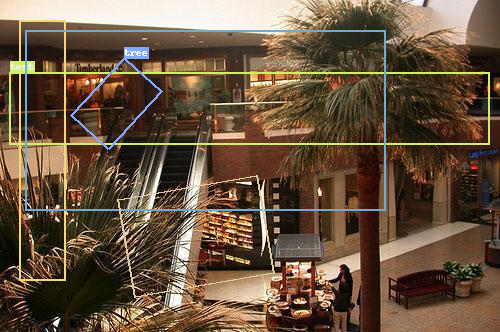

# PIL Drawer


<!-- WARNING: THIS FILE WAS AUTOGENERATED! DO NOT EDIT! -->

------------------------------------------------------------------------

<a
href="https://github.com/lgvaz/polvo/blob/master/polvo/draw/pil_drawer.py#L12"
target="_blank" style="float:right; font-size:smaller">source</a>

### PILDrawer

>      PILDrawer ()

*Initialize self. See help(type(self)) for accurate signature.*

``` python
records = [pv.ImageFile(str(pv.test.SEG_IMAGE)),
           pb.BBox.from_xyxy(20, 20, 64, 280),
           pb.BBoxLabeled(pb.BBox.from_xywh(10, 72, 478, 72), pv.Label(0, 'test')),
           pb.BBox.from_relative_xcycwh(.4, .4, .7, .6, 512, 300),
           pb.OBBox.from_clockwise(256,175, 100,140, 80),
           pb.BBoxLabeled(pb.OBBox.from_clockwise(124,58, 50,78, 42), pv.Label(1, 'tree'))]
```

``` python
drawer = PILDrawer()
drawer.draw(records)
```


