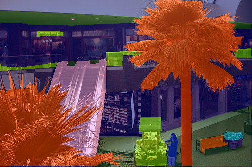

# Visualization


<!-- WARNING: THIS FILE WAS AUTOGENERATED! DO NOT EDIT! -->

------------------------------------------------------------------------

<a
href="https://github.com/lgvaz/polvo/blob/master/polvo/segmentation/vis.py#L13"
target="_blank" style="float:right; font-size:smaller">source</a>

### overlay_mask

>      overlay_mask (image:<module'PIL.Image'from'/opt/hostedtoolcache/Python/3.
>                    10.14/x64/lib/python3.10/site-packages/PIL/Image.py'>, mask
>                    :<module'PIL.Image'from'/opt/hostedtoolcache/Python/3.10.14
>                    /x64/lib/python3.10/site-packages/PIL/Image.py'>,
>                    nclasses:int, cmap:matplotlib.colors.Colormap=<matplotlib.c
>                    olors.LinearSegmentedColormap object at 0x7fda4e2f0cd0>,
>                    alpha:float=0.5)

``` python
image = pv.open_image(pv.test.SEG_IMAGE)
mask = pv.open_mask(pv.test.SEG_MASK)
```

``` python
overlay_mask(image, mask, 105)
```


