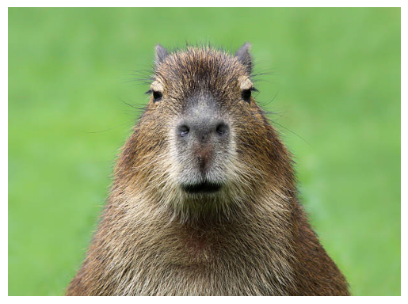

# Download


<!-- WARNING: THIS FILE WAS AUTOGENERATED! DO NOT EDIT! -->

------------------------------------------------------------------------

<a
href="https://github.com/lgvaz/polvo/blob/master/polvo/utils/download.py#L12"
target="_blank" style="float:right; font-size:smaller">source</a>

### download

>      download (url, save_dir, filename=None, chunk_size=1024)

*Download file from url*

------------------------------------------------------------------------

<a
href="https://github.com/lgvaz/polvo/blob/master/polvo/utils/download.py#L27"
target="_blank" style="float:right; font-size:smaller">source</a>

### download_and_extract

>      download_and_extract (url, save_dir, chunk_size=1024)

``` python
with TemporaryDirectory() as d:
    download_and_extract('https://s3.amazonaws.com/fast-ai-sample/mnist_tiny.tgz', d)
```

      0%|          | 0/342207 [00:00<?, ?B/s]

------------------------------------------------------------------------

<a
href="https://github.com/lgvaz/polvo/blob/master/polvo/utils/download.py#L33"
target="_blank" style="float:right; font-size:smaller">source</a>

### download_gdrive

>      download_gdrive (url)

*Download from gdrive, passing virus scan for big files.*

------------------------------------------------------------------------

<a
href="https://github.com/lgvaz/polvo/blob/master/polvo/utils/download.py#L39"
target="_blank" style="float:right; font-size:smaller">source</a>

### download_and_extract_gdrive

>      download_and_extract_gdrive (url, extract_dir)

------------------------------------------------------------------------

<a
href="https://github.com/lgvaz/polvo/blob/master/polvo/utils/download.py#L48"
target="_blank" style="float:right; font-size:smaller">source</a>

### open_image_url

>      open_image_url (url, gray=False, ignore_exif=True)

``` python
img = open_image_url('https://media.istockphoto.com/id/177228186/pt/foto/jovem-capivara.jpg?s=612x612&w=0&k=20&c=HIaHC5JhfE3zobczCLIEY6bdy2NdOLq0sskZkuXsM9w=')
pv.show_image(img)
```

      0%|          | 0/51402 [00:00<?, ?B/s]


