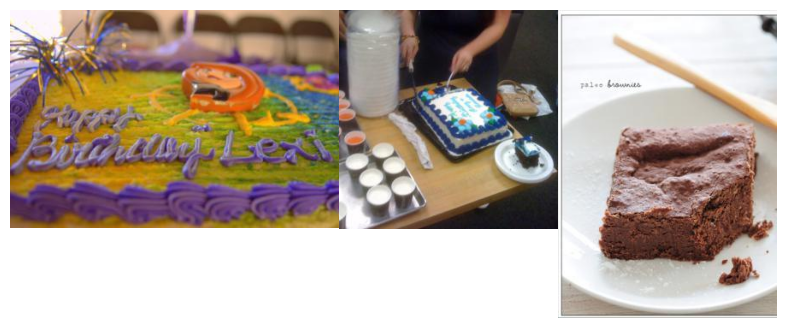
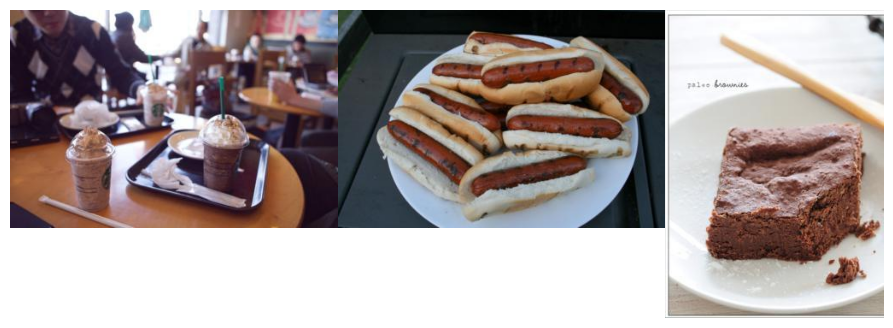
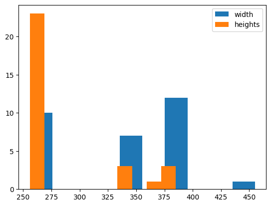

# Visualization


<!-- WARNING: THIS FILE WAS AUTOGENERATED! DO NOT EDIT! -->

    /opt/hostedtoolcache/Python/3.10.14/x64/lib/python3.10/site-packages/fastcore/docscrape.py:230: UserWarning: Unknown section See Also
      else: warn(msg)

------------------------------------------------------------------------

<a
href="https://github.com/lgvaz/polvo/blob/master/polvo/utils/visualization.py#L19"
target="_blank" style="float:right; font-size:smaller">source</a>

### show_image

>      show_image (image, ax=None, cmap=None, show:bool=False, nrows:int=1,
>                  ncols:int=1,
>                  sharex:"bool|Literal['none','all','row','col']"=False,
>                  sharey:"bool|Literal['none','all','row','col']"=False,
>                  squeeze:bool=True, width_ratios:Sequence[float]|None=None,
>                  height_ratios:Sequence[float]|None=None,
>                  subplot_kw:dict[str,Any]|None=None,
>                  gridspec_kw:dict[str,Any]|None=None)

<table>
<colgroup>
<col style="width: 6%" />
<col style="width: 25%" />
<col style="width: 34%" />
<col style="width: 34%" />
</colgroup>
<thead>
<tr class="header">
<th></th>
<th><strong>Type</strong></th>
<th><strong>Default</strong></th>
<th><strong>Details</strong></th>
</tr>
</thead>
<tbody>
<tr class="odd">
<td>image</td>
<td></td>
<td></td>
<td></td>
</tr>
<tr class="even">
<td>ax</td>
<td>NoneType</td>
<td>None</td>
<td></td>
</tr>
<tr class="odd">
<td>cmap</td>
<td>NoneType</td>
<td>None</td>
<td></td>
</tr>
<tr class="even">
<td>show</td>
<td>bool</td>
<td>False</td>
<td></td>
</tr>
<tr class="odd">
<td>nrows</td>
<td>int</td>
<td>1</td>
<td></td>
</tr>
<tr class="even">
<td>ncols</td>
<td>int</td>
<td>1</td>
<td></td>
</tr>
<tr class="odd">
<td>sharex</td>
<td>bool | Literal[‘none’, ‘all’, ‘row’, ‘col’]</td>
<td>False</td>
<td></td>
</tr>
<tr class="even">
<td>sharey</td>
<td>bool | Literal[‘none’, ‘all’, ‘row’, ‘col’]</td>
<td>False</td>
<td></td>
</tr>
<tr class="odd">
<td>squeeze</td>
<td>bool</td>
<td>True</td>
<td>- If True, extra dimensions are squeezed out from the returned<br>
array of <code>~matplotlib.axes.Axes</code>:<br><br> - if only one
subplot is constructed (nrows=ncols=1), the<br> resulting single Axes
object is returned as a scalar.<br> - for Nx1 or 1xM subplots, the
returned object is a 1D numpy<br> object array of Axes objects.<br> -
for NxM, subplots with N&gt;1 and M&gt;1 are returned as a 2D
array.<br><br>- If False, no squeezing at all is done: the returned Axes
object is<br> always a 2D array containing Axes instances, even if it
ends up<br> being 1x1.</td>
</tr>
<tr class="even">
<td>width_ratios</td>
<td>Sequence[float] | None</td>
<td>None</td>
<td>Defines the relative widths of the columns. Each column gets
a<br>relative width of
<code>width_ratios[i] / sum(width_ratios)</code>.<br>If not given, all
columns will have the same width. Equivalent<br>to
<code>gridspec_kw={'width_ratios': [...]}</code>.</td>
</tr>
<tr class="odd">
<td>height_ratios</td>
<td>Sequence[float] | None</td>
<td>None</td>
<td>Defines the relative heights of the rows. Each row gets
a<br>relative height of
<code>height_ratios[i] / sum(height_ratios)</code>.<br>If not given, all
rows will have the same height. Convenience<br>for
<code>gridspec_kw={'height_ratios': [...]}</code>.</td>
</tr>
<tr class="even">
<td>subplot_kw</td>
<td>dict[str, Any] | None</td>
<td>None</td>
<td>Dict with keywords passed to
the<br><code>~matplotlib.figure.Figure.add_subplot</code> call used to
create each<br>subplot.</td>
</tr>
<tr class="odd">
<td>gridspec_kw</td>
<td>dict[str, Any] | None</td>
<td>None</td>
<td>Dict with keywords passed to the
<code>~matplotlib.gridspec.GridSpec</code><br>constructor used to create
the grid the subplots are placed on.</td>
</tr>
</tbody>
</table>

``` python
data_dir = pv.mkdir('snacks', tmp=True, exist_ok=True, overwrite=True)
data_dir = pv.download_and_extract('https://github.com/lgvaz/polvo-datasets-hub/releases/download/snacks/snacks.zip', data_dir)
image_files = pv.get_image_files(data_dir)
```

      0%|          | 0/438252 [00:00<?, ?B/s]

``` python
image = pv.open_image(image_files[4])
```

``` python
show_image(image)
```


------------------------------------------------------------------------

<a
href="https://github.com/lgvaz/polvo/blob/master/polvo/utils/visualization.py#L28"
target="_blank" style="float:right; font-size:smaller">source</a>

### get_grid

>      get_grid (nitems=None, ncols=3, nrows=None, pad=0.3, figsize=None,
>                grid_class=<class 'mpl_toolkits.axes_grid1.axes_grid.Grid'>,
>                ngrids=None, direction='row', axes_pad=0.02, share_all=False,
>                share_x=True, share_y=True, label_mode='L', axes_class=None,
>                aspect=False)

*Creates axes optimized for displaying images.*

<table>
<colgroup>
<col style="width: 6%" />
<col style="width: 25%" />
<col style="width: 34%" />
<col style="width: 34%" />
</colgroup>
<thead>
<tr class="header">
<th></th>
<th><strong>Type</strong></th>
<th><strong>Default</strong></th>
<th><strong>Details</strong></th>
</tr>
</thead>
<tbody>
<tr class="odd">
<td>nitems</td>
<td>NoneType</td>
<td>None</td>
<td></td>
</tr>
<tr class="even">
<td>ncols</td>
<td>int</td>
<td>3</td>
<td></td>
</tr>
<tr class="odd">
<td>nrows</td>
<td>NoneType</td>
<td>None</td>
<td></td>
</tr>
<tr class="even">
<td>pad</td>
<td>float</td>
<td>0.3</td>
<td></td>
</tr>
<tr class="odd">
<td>figsize</td>
<td>NoneType</td>
<td>None</td>
<td></td>
</tr>
<tr class="even">
<td>grid_class</td>
<td>type</td>
<td>Grid</td>
<td></td>
</tr>
<tr class="odd">
<td>ngrids</td>
<td>NoneType</td>
<td>None</td>
<td>If not None, only the first <em>ngrids</em> axes in the grid are
created.</td>
</tr>
<tr class="even">
<td>direction</td>
<td>str</td>
<td>row</td>
<td>Whether axes are created in row-major (“row by row”)
or<br>column-major order (“column by column”). This also affects
the<br>order in which axes are accessed using indexing
(<code>grid[index]</code>).</td>
</tr>
<tr class="odd">
<td>axes_pad</td>
<td>float</td>
<td>0.02</td>
<td>Padding or (horizontal padding, vertical padding) between axes,
in<br>inches.</td>
</tr>
<tr class="even">
<td>share_all</td>
<td>bool</td>
<td>False</td>
<td>Whether all axes share their x- and y-axis. Overrides
<em>share_x</em><br>and <em>share_y</em>.</td>
</tr>
<tr class="odd">
<td>share_x</td>
<td>bool</td>
<td>True</td>
<td>Whether all axes of a column share their x-axis.</td>
</tr>
<tr class="even">
<td>share_y</td>
<td>bool</td>
<td>True</td>
<td>Whether all axes of a row share their y-axis.</td>
</tr>
<tr class="odd">
<td>label_mode</td>
<td>str</td>
<td>L</td>
<td>Determines which axes will get tick labels:<br><br>- “L”: All axes
on the left column get vertical tick labels;<br> all axes on the bottom
row get horizontal tick labels.<br>- “1”: Only the bottom left axes is
labelled.<br>- “all”: All axes are labelled.<br>- “keep”: Do not do
anything.</td>
</tr>
<tr class="even">
<td>axes_class</td>
<td>NoneType</td>
<td>None</td>
<td>The type of Axes to create.</td>
</tr>
<tr class="odd">
<td>aspect</td>
<td>bool</td>
<td>False</td>
<td>Whether the axes aspect ratio follows the aspect ratio of the
data<br>limits.</td>
</tr>
</tbody>
</table>

------------------------------------------------------------------------

<a
href="https://github.com/lgvaz/polvo/blob/master/polvo/utils/visualization.py#L48"
target="_blank" style="float:right; font-size:smaller">source</a>

### get_image_grid

>      get_image_grid (nitems=None, ncols=3, nrows=None, pad=0.0, figsize=None,
>                      grid_class=<class
>                      'mpl_toolkits.axes_grid1.axes_grid.Grid'>, ngrids=None,
>                      direction='row', axes_pad=0.02, share_all=False,
>                      share_x=True, share_y=True, label_mode='L',
>                      axes_class=None, aspect=False)

*Creates axes optimized for displaying images.*

<table>
<colgroup>
<col style="width: 6%" />
<col style="width: 25%" />
<col style="width: 34%" />
<col style="width: 34%" />
</colgroup>
<thead>
<tr class="header">
<th></th>
<th><strong>Type</strong></th>
<th><strong>Default</strong></th>
<th><strong>Details</strong></th>
</tr>
</thead>
<tbody>
<tr class="odd">
<td>nitems</td>
<td>NoneType</td>
<td>None</td>
<td></td>
</tr>
<tr class="even">
<td>ncols</td>
<td>int</td>
<td>3</td>
<td></td>
</tr>
<tr class="odd">
<td>nrows</td>
<td>NoneType</td>
<td>None</td>
<td></td>
</tr>
<tr class="even">
<td>pad</td>
<td>float</td>
<td>0.0</td>
<td></td>
</tr>
<tr class="odd">
<td>figsize</td>
<td>NoneType</td>
<td>None</td>
<td></td>
</tr>
<tr class="even">
<td>grid_class</td>
<td>type</td>
<td>Grid</td>
<td></td>
</tr>
<tr class="odd">
<td>ngrids</td>
<td>NoneType</td>
<td>None</td>
<td>If not None, only the first <em>ngrids</em> axes in the grid are
created.</td>
</tr>
<tr class="even">
<td>direction</td>
<td>str</td>
<td>row</td>
<td>Whether axes are created in row-major (“row by row”)
or<br>column-major order (“column by column”). This also affects
the<br>order in which axes are accessed using indexing
(<code>grid[index]</code>).</td>
</tr>
<tr class="odd">
<td>axes_pad</td>
<td>float</td>
<td>0.02</td>
<td>Padding or (horizontal padding, vertical padding) between axes,
in<br>inches.</td>
</tr>
<tr class="even">
<td>share_all</td>
<td>bool</td>
<td>False</td>
<td>Whether all axes share their x- and y-axis. Overrides
<em>share_x</em><br>and <em>share_y</em>.</td>
</tr>
<tr class="odd">
<td>share_x</td>
<td>bool</td>
<td>True</td>
<td>Whether all axes of a column share their x-axis.</td>
</tr>
<tr class="even">
<td>share_y</td>
<td>bool</td>
<td>True</td>
<td>Whether all axes of a row share their y-axis.</td>
</tr>
<tr class="odd">
<td>label_mode</td>
<td>str</td>
<td>L</td>
<td>Determines which axes will get tick labels:<br><br>- “L”: All axes
on the left column get vertical tick labels;<br> all axes on the bottom
row get horizontal tick labels.<br>- “1”: Only the bottom left axes is
labelled.<br>- “all”: All axes are labelled.<br>- “keep”: Do not do
anything.</td>
</tr>
<tr class="even">
<td>axes_class</td>
<td>NoneType</td>
<td>None</td>
<td>The type of Axes to create.</td>
</tr>
<tr class="odd">
<td>aspect</td>
<td>bool</td>
<td>False</td>
<td>Whether the axes aspect ratio follows the aspect ratio of the
data<br>limits.</td>
</tr>
</tbody>
</table>

------------------------------------------------------------------------

<a
href="https://github.com/lgvaz/polvo/blob/master/polvo/utils/visualization.py#L53"
target="_blank" style="float:right; font-size:smaller">source</a>

### show_grid

>      show_grid (grid, shows, show=True)

------------------------------------------------------------------------

<a
href="https://github.com/lgvaz/polvo/blob/master/polvo/utils/visualization.py#L58"
target="_blank" style="float:right; font-size:smaller">source</a>

### normalize_axes

>      normalize_axes (grid, xmax, ymax)

*Expand all axes to have the same dimensions.*

------------------------------------------------------------------------

<a
href="https://github.com/lgvaz/polvo/blob/master/polvo/utils/visualization.py#L66"
target="_blank" style="float:right; font-size:smaller">source</a>

### plot_grid

>      plot_grid (shows, show=True, xmax=None, ymax=None, ncols=3, nrows=None,
>                 pad=0.0, figsize=None, grid_class=<class
>                 'mpl_toolkits.axes_grid1.axes_grid.Grid'>, ngrids=None,
>                 direction='row', axes_pad=0.02, share_all=False, share_x=True,
>                 share_y=True, label_mode='L', axes_class=None, aspect=False)

*Quickly plot a grid of images.*

<table>
<colgroup>
<col style="width: 6%" />
<col style="width: 25%" />
<col style="width: 34%" />
<col style="width: 34%" />
</colgroup>
<thead>
<tr class="header">
<th></th>
<th><strong>Type</strong></th>
<th><strong>Default</strong></th>
<th><strong>Details</strong></th>
</tr>
</thead>
<tbody>
<tr class="odd">
<td>shows</td>
<td></td>
<td></td>
<td></td>
</tr>
<tr class="even">
<td>show</td>
<td>bool</td>
<td>True</td>
<td></td>
</tr>
<tr class="odd">
<td>xmax</td>
<td>NoneType</td>
<td>None</td>
<td></td>
</tr>
<tr class="even">
<td>ymax</td>
<td>NoneType</td>
<td>None</td>
<td></td>
</tr>
<tr class="odd">
<td>ncols</td>
<td>int</td>
<td>3</td>
<td></td>
</tr>
<tr class="even">
<td>nrows</td>
<td>NoneType</td>
<td>None</td>
<td></td>
</tr>
<tr class="odd">
<td>pad</td>
<td>float</td>
<td>0.0</td>
<td></td>
</tr>
<tr class="even">
<td>figsize</td>
<td>NoneType</td>
<td>None</td>
<td></td>
</tr>
<tr class="odd">
<td>grid_class</td>
<td>type</td>
<td>Grid</td>
<td></td>
</tr>
<tr class="even">
<td>ngrids</td>
<td>NoneType</td>
<td>None</td>
<td>If not None, only the first <em>ngrids</em> axes in the grid are
created.</td>
</tr>
<tr class="odd">
<td>direction</td>
<td>str</td>
<td>row</td>
<td>Whether axes are created in row-major (“row by row”)
or<br>column-major order (“column by column”). This also affects
the<br>order in which axes are accessed using indexing
(<code>grid[index]</code>).</td>
</tr>
<tr class="even">
<td>axes_pad</td>
<td>float</td>
<td>0.02</td>
<td>Padding or (horizontal padding, vertical padding) between axes,
in<br>inches.</td>
</tr>
<tr class="odd">
<td>share_all</td>
<td>bool</td>
<td>False</td>
<td>Whether all axes share their x- and y-axis. Overrides
<em>share_x</em><br>and <em>share_y</em>.</td>
</tr>
<tr class="even">
<td>share_x</td>
<td>bool</td>
<td>True</td>
<td>Whether all axes of a column share their x-axis.</td>
</tr>
<tr class="odd">
<td>share_y</td>
<td>bool</td>
<td>True</td>
<td>Whether all axes of a row share their y-axis.</td>
</tr>
<tr class="even">
<td>label_mode</td>
<td>str</td>
<td>L</td>
<td>Determines which axes will get tick labels:<br><br>- “L”: All axes
on the left column get vertical tick labels;<br> all axes on the bottom
row get horizontal tick labels.<br>- “1”: Only the bottom left axes is
labelled.<br>- “all”: All axes are labelled.<br>- “keep”: Do not do
anything.</td>
</tr>
<tr class="odd">
<td>axes_class</td>
<td>NoneType</td>
<td>None</td>
<td>The type of Axes to create.</td>
</tr>
<tr class="even">
<td>aspect</td>
<td>bool</td>
<td>False</td>
<td>Whether the axes aspect ratio follows the aspect ratio of the
data<br>limits.</td>
</tr>
</tbody>
</table>

------------------------------------------------------------------------

<a
href="https://github.com/lgvaz/polvo/blob/master/polvo/utils/visualization.py#L75"
target="_blank" style="float:right; font-size:smaller">source</a>

### image_grid

>      image_grid (images, *args, show=True, xmax=None, ymax=None, ncols=3,
>                  nrows=None, pad=0.0, figsize=None, grid_class=<class
>                  'mpl_toolkits.axes_grid1.axes_grid.Grid'>, ngrids=None,
>                  direction='row', axes_pad=0.02, share_all=False,
>                  share_x=True, share_y=True, label_mode='L', axes_class=None,
>                  aspect=False)

<table>
<colgroup>
<col style="width: 6%" />
<col style="width: 25%" />
<col style="width: 34%" />
<col style="width: 34%" />
</colgroup>
<thead>
<tr class="header">
<th></th>
<th><strong>Type</strong></th>
<th><strong>Default</strong></th>
<th><strong>Details</strong></th>
</tr>
</thead>
<tbody>
<tr class="odd">
<td>images</td>
<td></td>
<td></td>
<td></td>
</tr>
<tr class="even">
<td>args</td>
<td></td>
<td></td>
<td></td>
</tr>
<tr class="odd">
<td>show</td>
<td>bool</td>
<td>True</td>
<td></td>
</tr>
<tr class="even">
<td>xmax</td>
<td>NoneType</td>
<td>None</td>
<td></td>
</tr>
<tr class="odd">
<td>ymax</td>
<td>NoneType</td>
<td>None</td>
<td></td>
</tr>
<tr class="even">
<td>ncols</td>
<td>int</td>
<td>3</td>
<td></td>
</tr>
<tr class="odd">
<td>nrows</td>
<td>NoneType</td>
<td>None</td>
<td></td>
</tr>
<tr class="even">
<td>pad</td>
<td>float</td>
<td>0.0</td>
<td></td>
</tr>
<tr class="odd">
<td>figsize</td>
<td>NoneType</td>
<td>None</td>
<td></td>
</tr>
<tr class="even">
<td>grid_class</td>
<td>type</td>
<td>Grid</td>
<td></td>
</tr>
<tr class="odd">
<td>ngrids</td>
<td>NoneType</td>
<td>None</td>
<td>If not None, only the first <em>ngrids</em> axes in the grid are
created.</td>
</tr>
<tr class="even">
<td>direction</td>
<td>str</td>
<td>row</td>
<td>Whether axes are created in row-major (“row by row”)
or<br>column-major order (“column by column”). This also affects
the<br>order in which axes are accessed using indexing
(<code>grid[index]</code>).</td>
</tr>
<tr class="odd">
<td>axes_pad</td>
<td>float</td>
<td>0.02</td>
<td>Padding or (horizontal padding, vertical padding) between axes,
in<br>inches.</td>
</tr>
<tr class="even">
<td>share_all</td>
<td>bool</td>
<td>False</td>
<td>Whether all axes share their x- and y-axis. Overrides
<em>share_x</em><br>and <em>share_y</em>.</td>
</tr>
<tr class="odd">
<td>share_x</td>
<td>bool</td>
<td>True</td>
<td>Whether all axes of a column share their x-axis.</td>
</tr>
<tr class="even">
<td>share_y</td>
<td>bool</td>
<td>True</td>
<td>Whether all axes of a row share their y-axis.</td>
</tr>
<tr class="odd">
<td>label_mode</td>
<td>str</td>
<td>L</td>
<td>Determines which axes will get tick labels:<br><br>- “L”: All axes
on the left column get vertical tick labels;<br> all axes on the bottom
row get horizontal tick labels.<br>- “1”: Only the bottom left axes is
labelled.<br>- “all”: All axes are labelled.<br>- “keep”: Do not do
anything.</td>
</tr>
<tr class="even">
<td>axes_class</td>
<td>NoneType</td>
<td>None</td>
<td>The type of Axes to create.</td>
</tr>
<tr class="odd">
<td>aspect</td>
<td>bool</td>
<td>False</td>
<td>Whether the axes aspect ratio follows the aspect ratio of the
data<br>limits.</td>
</tr>
</tbody>
</table>

``` python
image_grid(map(pv.open_image, image_files[:3]))
```



    (<Figure size 1400x400 with 6 Axes>,
     <mpl_toolkits.axes_grid1.axes_grid.ImageGrid>)

------------------------------------------------------------------------

<a
href="https://github.com/lgvaz/polvo/blob/master/polvo/utils/visualization.py#L81"
target="_blank" style="float:right; font-size:smaller">source</a>

### show_images

>      show_images (images, *args, show=True, xmax=None, ymax=None, ncols=3,
>                   nrows=None, pad=0.0, figsize=None, grid_class=<class
>                   'mpl_toolkits.axes_grid1.axes_grid.Grid'>, ngrids=None,
>                   direction='row', axes_pad=0.02, share_all=False,
>                   share_x=True, share_y=True, label_mode='L', axes_class=None,
>                   aspect=False)

*Same as
[`image_grid`](https://lgvaz.github.io/polvo/utils.visualization.html#image_grid)*

<table>
<colgroup>
<col style="width: 6%" />
<col style="width: 25%" />
<col style="width: 34%" />
<col style="width: 34%" />
</colgroup>
<thead>
<tr class="header">
<th></th>
<th><strong>Type</strong></th>
<th><strong>Default</strong></th>
<th><strong>Details</strong></th>
</tr>
</thead>
<tbody>
<tr class="odd">
<td>images</td>
<td></td>
<td></td>
<td></td>
</tr>
<tr class="even">
<td>args</td>
<td></td>
<td></td>
<td></td>
</tr>
<tr class="odd">
<td>show</td>
<td>bool</td>
<td>True</td>
<td></td>
</tr>
<tr class="even">
<td>xmax</td>
<td>NoneType</td>
<td>None</td>
<td></td>
</tr>
<tr class="odd">
<td>ymax</td>
<td>NoneType</td>
<td>None</td>
<td></td>
</tr>
<tr class="even">
<td>ncols</td>
<td>int</td>
<td>3</td>
<td></td>
</tr>
<tr class="odd">
<td>nrows</td>
<td>NoneType</td>
<td>None</td>
<td></td>
</tr>
<tr class="even">
<td>pad</td>
<td>float</td>
<td>0.0</td>
<td></td>
</tr>
<tr class="odd">
<td>figsize</td>
<td>NoneType</td>
<td>None</td>
<td></td>
</tr>
<tr class="even">
<td>grid_class</td>
<td>type</td>
<td>Grid</td>
<td></td>
</tr>
<tr class="odd">
<td>ngrids</td>
<td>NoneType</td>
<td>None</td>
<td>If not None, only the first <em>ngrids</em> axes in the grid are
created.</td>
</tr>
<tr class="even">
<td>direction</td>
<td>str</td>
<td>row</td>
<td>Whether axes are created in row-major (“row by row”)
or<br>column-major order (“column by column”). This also affects
the<br>order in which axes are accessed using indexing
(<code>grid[index]</code>).</td>
</tr>
<tr class="odd">
<td>axes_pad</td>
<td>float</td>
<td>0.02</td>
<td>Padding or (horizontal padding, vertical padding) between axes,
in<br>inches.</td>
</tr>
<tr class="even">
<td>share_all</td>
<td>bool</td>
<td>False</td>
<td>Whether all axes share their x- and y-axis. Overrides
<em>share_x</em><br>and <em>share_y</em>.</td>
</tr>
<tr class="odd">
<td>share_x</td>
<td>bool</td>
<td>True</td>
<td>Whether all axes of a column share their x-axis.</td>
</tr>
<tr class="even">
<td>share_y</td>
<td>bool</td>
<td>True</td>
<td>Whether all axes of a row share their y-axis.</td>
</tr>
<tr class="odd">
<td>label_mode</td>
<td>str</td>
<td>L</td>
<td>Determines which axes will get tick labels:<br><br>- “L”: All axes
on the left column get vertical tick labels;<br> all axes on the bottom
row get horizontal tick labels.<br>- “1”: Only the bottom left axes is
labelled.<br>- “all”: All axes are labelled.<br>- “keep”: Do not do
anything.</td>
</tr>
<tr class="even">
<td>axes_class</td>
<td>NoneType</td>
<td>None</td>
<td>The type of Axes to create.</td>
</tr>
<tr class="odd">
<td>aspect</td>
<td>bool</td>
<td>False</td>
<td>Whether the axes aspect ratio follows the aspect ratio of the
data<br>limits.</td>
</tr>
</tbody>
</table>

------------------------------------------------------------------------

<a
href="https://github.com/lgvaz/polvo/blob/master/polvo/utils/visualization.py#L87"
target="_blank" style="float:right; font-size:smaller">source</a>

### grid_from_sequence

>      grid_from_sequence (sequence, get_image, nitems=9, idxs=None, show=True,
>                          xmax=None, ymax=None, ncols=3, nrows=None, pad=0.0,
>                          figsize=None, grid_class=<class
>                          'mpl_toolkits.axes_grid1.axes_grid.Grid'>,
>                          ngrids=None, direction='row', axes_pad=0.02,
>                          share_all=False, share_x=True, share_y=True,
>                          label_mode='L', axes_class=None, aspect=False)

*Generates a grid of images from a subset of items from the sequence.*

<table>
<colgroup>
<col style="width: 6%" />
<col style="width: 25%" />
<col style="width: 34%" />
<col style="width: 34%" />
</colgroup>
<thead>
<tr class="header">
<th></th>
<th><strong>Type</strong></th>
<th><strong>Default</strong></th>
<th><strong>Details</strong></th>
</tr>
</thead>
<tbody>
<tr class="odd">
<td>sequence</td>
<td></td>
<td></td>
<td></td>
</tr>
<tr class="even">
<td>get_image</td>
<td></td>
<td></td>
<td></td>
</tr>
<tr class="odd">
<td>nitems</td>
<td>int</td>
<td>9</td>
<td></td>
</tr>
<tr class="even">
<td>idxs</td>
<td>NoneType</td>
<td>None</td>
<td></td>
</tr>
<tr class="odd">
<td>show</td>
<td>bool</td>
<td>True</td>
<td></td>
</tr>
<tr class="even">
<td>xmax</td>
<td>NoneType</td>
<td>None</td>
<td></td>
</tr>
<tr class="odd">
<td>ymax</td>
<td>NoneType</td>
<td>None</td>
<td></td>
</tr>
<tr class="even">
<td>ncols</td>
<td>int</td>
<td>3</td>
<td></td>
</tr>
<tr class="odd">
<td>nrows</td>
<td>NoneType</td>
<td>None</td>
<td></td>
</tr>
<tr class="even">
<td>pad</td>
<td>float</td>
<td>0.0</td>
<td></td>
</tr>
<tr class="odd">
<td>figsize</td>
<td>NoneType</td>
<td>None</td>
<td></td>
</tr>
<tr class="even">
<td>grid_class</td>
<td>type</td>
<td>Grid</td>
<td></td>
</tr>
<tr class="odd">
<td>ngrids</td>
<td>NoneType</td>
<td>None</td>
<td>If not None, only the first <em>ngrids</em> axes in the grid are
created.</td>
</tr>
<tr class="even">
<td>direction</td>
<td>str</td>
<td>row</td>
<td>Whether axes are created in row-major (“row by row”)
or<br>column-major order (“column by column”). This also affects
the<br>order in which axes are accessed using indexing
(<code>grid[index]</code>).</td>
</tr>
<tr class="odd">
<td>axes_pad</td>
<td>float</td>
<td>0.02</td>
<td>Padding or (horizontal padding, vertical padding) between axes,
in<br>inches.</td>
</tr>
<tr class="even">
<td>share_all</td>
<td>bool</td>
<td>False</td>
<td>Whether all axes share their x- and y-axis. Overrides
<em>share_x</em><br>and <em>share_y</em>.</td>
</tr>
<tr class="odd">
<td>share_x</td>
<td>bool</td>
<td>True</td>
<td>Whether all axes of a column share their x-axis.</td>
</tr>
<tr class="even">
<td>share_y</td>
<td>bool</td>
<td>True</td>
<td>Whether all axes of a row share their y-axis.</td>
</tr>
<tr class="odd">
<td>label_mode</td>
<td>str</td>
<td>L</td>
<td>Determines which axes will get tick labels:<br><br>- “L”: All axes
on the left column get vertical tick labels;<br> all axes on the bottom
row get horizontal tick labels.<br>- “1”: Only the bottom left axes is
labelled.<br>- “all”: All axes are labelled.<br>- “keep”: Do not do
anything.</td>
</tr>
<tr class="even">
<td>axes_class</td>
<td>NoneType</td>
<td>None</td>
<td>The type of Axes to create.</td>
</tr>
<tr class="odd">
<td>aspect</td>
<td>bool</td>
<td>False</td>
<td>Whether the axes aspect ratio follows the aspect ratio of the
data<br>limits.</td>
</tr>
</tbody>
</table>

``` python
grid_from_sequence(image_files, lambda x: pv.open_image(x), nitems=3)
```



    (<Figure size 1400x400 with 6 Axes>,
     <mpl_toolkits.axes_grid1.axes_grid.ImageGrid>)

------------------------------------------------------------------------

<a
href="https://github.com/lgvaz/polvo/blob/master/polvo/utils/visualization.py#L98"
target="_blank" style="float:right; font-size:smaller">source</a>

### image_size

>      image_size (image_file)

------------------------------------------------------------------------

<a
href="https://github.com/lgvaz/polvo/blob/master/polvo/utils/visualization.py#L103"
target="_blank" style="float:right; font-size:smaller">source</a>

### image_sizes_hist

>      image_sizes_hist (image_files)

*Plot a histogram of widths and heights.*

<table>
<thead>
<tr class="header">
<th></th>
<th><strong>Details</strong></th>
</tr>
</thead>
<tbody>
<tr class="odd">
<td>image_files</td>
<td>Sequence of image filepaths.</td>
</tr>
</tbody>
</table>

``` python
image_sizes_hist(image_files)
```

<style>
    /* Turns off some styling */
    progress {
        /* gets rid of default border in Firefox and Opera. */
        border: none;
        /* Needs to be in here for Safari polyfill so background images work as expected. */
        background-size: auto;
    }
    progress:not([value]), progress:not([value])::-webkit-progress-bar {
        background: repeating-linear-gradient(45deg, #7e7e7e, #7e7e7e 10px, #5c5c5c 10px, #5c5c5c 20px);
    }
    .progress-bar-interrupted, .progress-bar-interrupted::-webkit-progress-bar {
        background: #F44336;
    }
</style>


